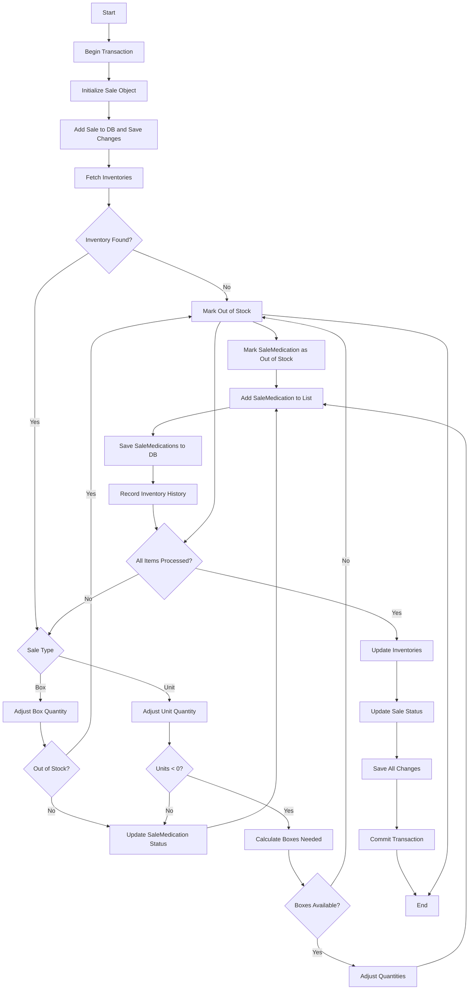
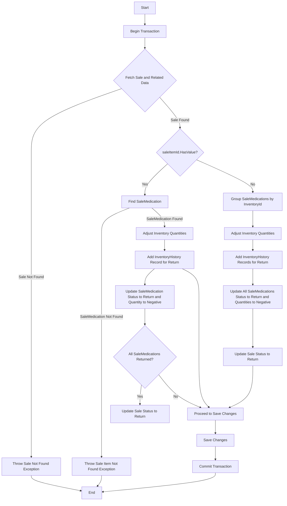

# PharmaHub API 🧠

The backend of PharmaHub is developed with [C#](https://dotnet.microsoft.com/en-us/languages/csharp), [.NET 8](https://dotnet.microsoft.com/en-us/download/dotnet/8.0), [ASP.NET Core WebAPI](https://dotnet.microsoft.com/en-us/apps/aspnet/apis). For the database, we use [Microsoft SQL Server](https://www.microsoft.com/en-us/sql-server/sql-server-downloads).
## FlowCharts

  
Create new sale functionality

  
  ### [Source Code](https://github.com/ID-JA/pharma-hub/blob/cb7e1baa7fd3b3898dfea6174528d4a297092461/PharmaHub.API/Services/Interfaces/ISaleService.cs#L31-L148?plain=1)
 

  
Cancel entire sale or single sale item functionality

  
  ### [Source Code](https://github.com/ID-JA/pharma-hub/blob/413ad137686c764cfca4f1f3d46fca20b0be208d/PharmaHub.API/Services/Interfaces/ISaleService.cs#L244-L359?plain=1)
 

## Copywriter and License
© [Jamal Id Aissa](https://github.com/ID-JA/), [Nazha Haida](https://github.com/nazhahaida)

This project is licensed under the MIT License.